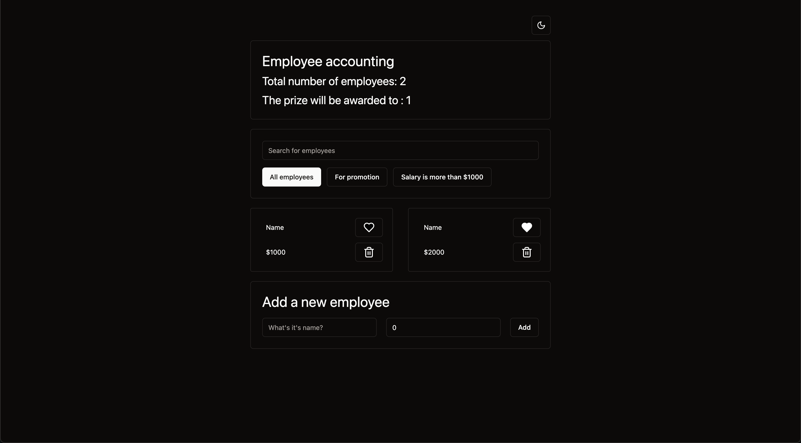

# Employee Accounting App
A simple app to manage employee data.



## Features
- Add new employee with name and salary
- Delete employee
- Edit employee
- Search employee by name
- Sort employee by promoted property and salary
- Change theme between light and dark mode

## Tech Stack
- React
- TypeScript
- Tailwind CSS
- Vite
- Shadcn

## How to use
1. Clone the repo
``` bash
git clone https://github.com/HajimeGit/EmployeeAccountingApp.git
```

2. Install dependencies
``` bash
npm install
```

3. Start the dev server
``` bash
npm run dev
```

## Contributing
Pull requests are welcome. For major changes, please open an issue first to discuss what you would like to change.

  